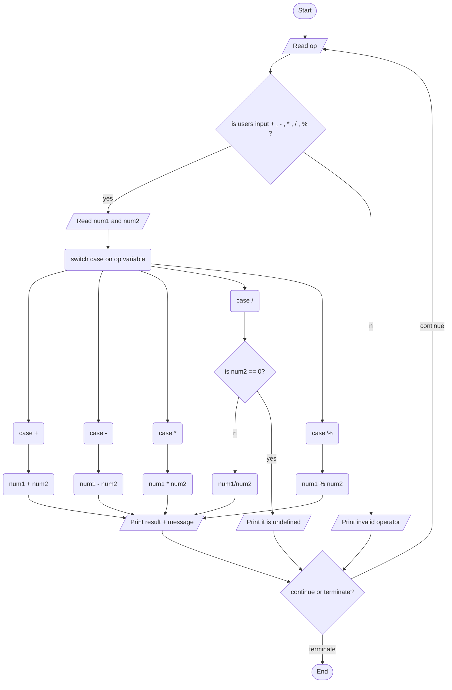

1. Problem Description 
    - write a program that acts as a simple calculator that provides arithmetic capabilities to the user. 
    The program should accept two integers and an operator from the user
2. Problem Analysis

Input:
    op: Character to store arithmetic operator entered by user
    num1, num2: Integers to store the two operands entered by user
Process:
    Read operand and operator from the user
    Validate operator
    Perform arithmetic operations based on the operator
        If +, add num1 and num2
        If -, subtract num2 from num1
        If *, multiply num1 and num2
        If /, divide num1 by num2
        If %, compute remainder when num1 is divided by num2
    Handle divide by 0 error case
Output:
    If invalid operator, print error
    If divide by 0, print undefined
    Otherwise, print the result of the arithmetic operation on num1 and num2

3. Algorithm 
    1. Start
    2. Declare variables
        op (character to store operator)
        num1 (integer to store first number)
        num2 (integer to store second number)
    3. Print message asking user to enter operator (+, -, *, /, %)
    4. Read user input into op
    5. Print message asking user to enter first number
    6.  Read user input into num1
    7. Print message asking user to enter second number
    8. Read user input into num2
    9. Use switch case on op variable
        - If +, print sum of num1 and num2
        - If -, print difference of num1 and num2
        - If *, print product of num1 and num2
        - If /, print quotient of num1 and num2
        - If %, print remainder of num1 and num2
        - If invalid operator, print error message
    10. Print message asking user to enter 0 to exit or any other key to continue
    11. Read user input into op
    12. If op is 0, go to step 13, otherwise go back to step 3
    13. Stop

Algortihm(Flowchart)
## Mermaid


```
