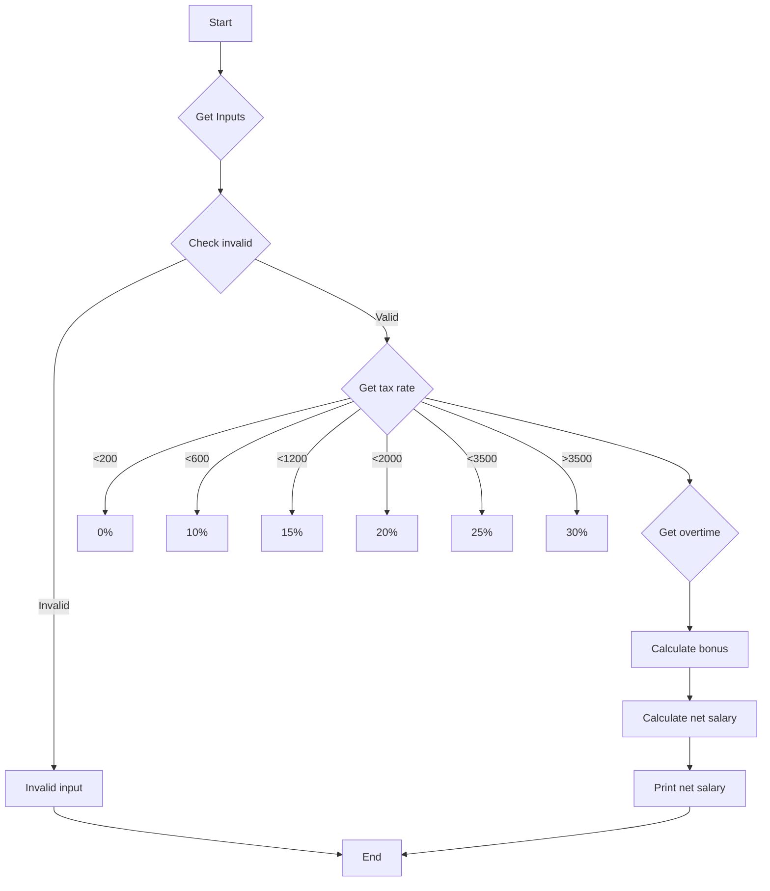

1. Problem Description
- Program to calculate net salary based on inputs for gross salary, working hours etc.

2. Problem Analysis

- Input: gross salary, bonus rate, working hours
- Process: Calculate pension, income tax, net salary
- Output: Net salary 

3. Algorithm

    1. Start 
    2. Initialize variables  
    - gross_salary, bonus_rate, working_hours
    3. Read input   
    - gross_salary, bonus_rate, working_hours
    4. Calculate pension
    5. Check gross salary 
    - Select income tax rate
    6. Calculate income tax
    7. Check working hours
    - If >40, calculate overtime
    8. Calculate bonus
    9. Calculate net salary 
    - gross - pension - tax + bonus
    10. Print net salary
    11. End

4. Algorithm (Flowchart)
## Mermaid

