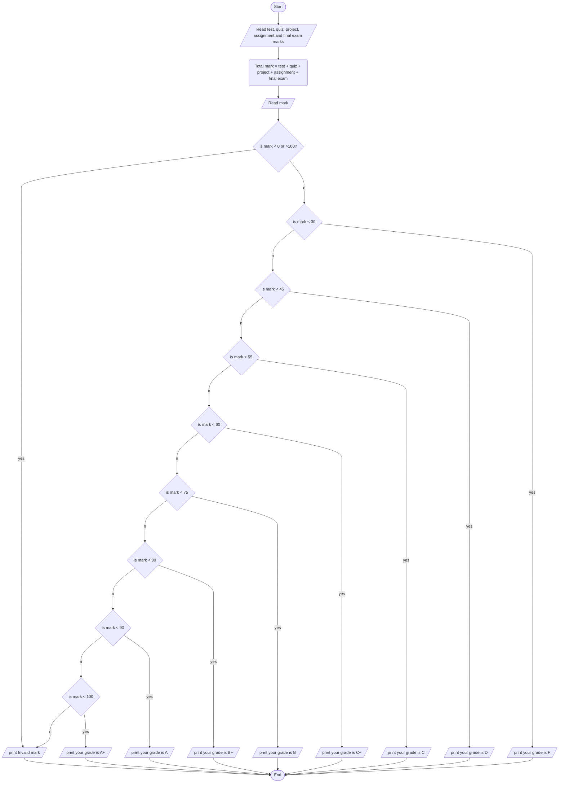

1. Problem Description 
- Write a program to accept marks scored in various course components by the user including - test, quiz, project, assignment and final exam. Calculate total mark based on pre-defined weightage for each component. Convert calculated total mark to corresponding letter grade.

2. Problem Analysis
Input:
    - test_mark (15% of total)
    - quiz_mark (5% of total)  
    - project_mark (20% of total)
    - assignment_mark (10% of total)
    - final_exam_mark (50% of total)
Process:
    - Accept test, quiz, project, assignment and final exam marks from user
    - Calculate total mark by summing component marks after applying weightage 
    - Validate total mark is between 0-100
    - Use if-else-if ladder to map total mark to letter grade (A+, A, B+, etc.)
Output:
    - Print validation message if invalid total mark
    - Print letter grade corresponding to calculated total mark  

3. Algorithm
    1. Start 
    2. Accept test, quiz, project, assignment and final exam marks from user
    3. Calculate total mark = test + quiz + project + assignment + final exam
    4. Validate total mark between 0 and 100
    5. Use if-else-if ladder to determine letter grade based on total mark
    6. Print "Your grade is: " + letter-grade
    7. Stop

4. Algorithm(Flowchart)
## Mermaid

