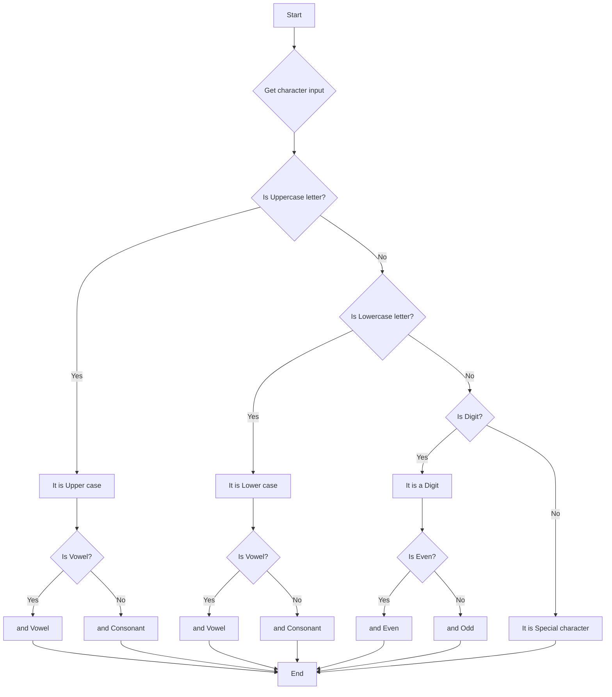

1. Problem Description
- Write a program to classify a character entered by user as uppercase letter, lowercase letter, digit or special symbol.

2. Problem Analysis  
Input
    - A character

Process
    - Read input character into ch
        - Check if ch is in different ranges:
        - Uppercase letter : 'A' to 'Z'
        - Lowercase letter : 'a' to 'z' 
        - Digit: '0' to '9'
    - For letters:
        - Check if vowel using switch case
        - Print vowel or consonant 
    - For digits: 
        - Check if even or odd
        - Print even or odd
    - Otherwise special character
Output
    - Print appropriate message saying whether uppercase, lowercase, digit or special character
    - For letters, print vowel or consonant
    - For digits, print even or odd 

3. Algorithm
    1. Start 
    3. Print "Enter a character" 
    4. Read input character into ch
    5. If ch >= 'A' and ch <= 'Z' 
        - Print "Uppercase letter"
        - Switch case on ch
            - Cases 'A', 'E', 'I', 'O', 'U' :
                - Print "Vowel"
            - Default:
                - Print "Consonant"
    6. Else if ch >= 'a' and ch <= 'z'
        - Print "Lowercase letter"
        - Same vowel/consonant check as above
    7. Else if ch >= '0' and ch <= '9' 
        - Print "Digit"
        - If (ch - '0')%2 == 0
            - Print "Even"
       - Else
            - Print "Odd"
    8. Else
        - Print "Special character"
    9. Stop

4. Algorithm(Flowchart)
## Mermaid

