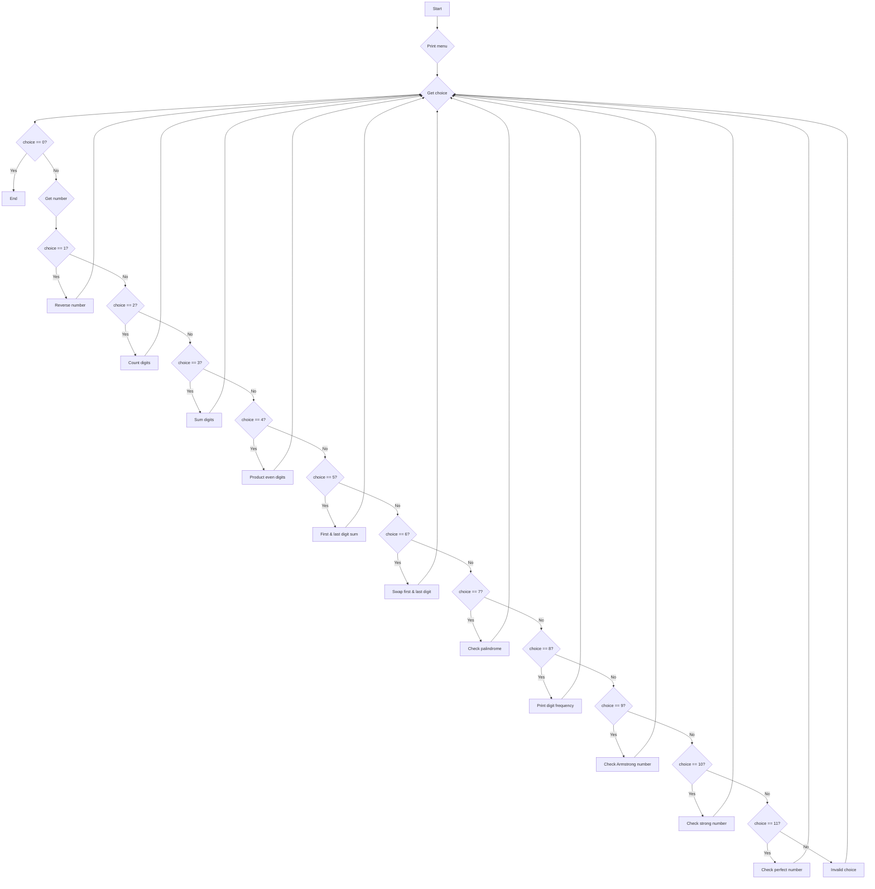

1. Problem Description
The program implements a menu-driven system to perform various operations on an input number such as reversing the digits, counting digits, finding sum and product of digits, checking if palindrome, finding frequency of digits etc.

2. Problem Analysis
- Input: User's choice of operation from menu and a number 
- Process: Performs the selected operation on the input number using loops, math functions, arrays etc. 
- Output: Displays result of selected operation on given number

3. Algorithm

   1. Stop
   2. Display menu options (1-11) 
   3. Take user's choice of operation
   4. If choice is 1-11, take an integer input number
   5. Use control structures to direct flow based on choice
   6. For choice 1:
      - Initialize reversed to 0
      - Extract each digit using % operator
      - Append extracted digit to reversed 
      - Return reversed number
   7. For choice 2:
      - Initialize count to 0
      - Divide number by 10 in loop to extract digits
      - Increment count in each iteration
      - Return final count
   8. For choice 3 (Sum of digits):
      - Initialize sum to 0
      - Extract each digit using % operator
      - Add the extracted digit to sum
      - Return final sum

   9. For choice 4 (Product of even digits):
      - Initialize prod to 1
      - Extract each digit using % operator
      - Check if digit is even using % 2
      - If even, multiply prod by digit
      - Return final prod  

   10. For choice 5 (First and last digit sum):
      - Get last digit using % operator
      - Divide number by 10 in loop to get first digit
      - Add first and last digits 
      - Print sum

   11. For choice 6 (Swap first and last digit):
      - Get last digit using % operator
      - Get first digit by dividing number in loop
      - Get remaining digits between first and last
      - Construct swapped number using math functions
      - Return swapped number

   12. For choice 7 (Check palindrome):
      - Reverse the number 
      - Compare reversed number with original number
      - If equal, print palindrome, else not palindrome

   13. For choice 8 (Frequency of digits):
      - Initialize frequency array of size 10 with 0s
      - Extract each digit and use it as index to increment frequency array
      - Print frequency array 
   14. For choice 9 (Check Armstrong Number):
      - Initialize num to number, digits to 0, temp to num
      - Count digits by dividing temp by 10 in loop
      - Initialize sum to 0 
      - Extract each digit of num
      - Raise the digit to power of total digits and add to sum
      - Compare sum with original number
      - If equal print Armstrong number else not Armstrong number

   15. For choice 10 (Check Strong Number):
      - Initialize num to number, sum to 0, temp to num 
      - Extract each digit 
      - Find factorial of digit in a loop
      - Add factorial of each digit to sum
      - Compare sum with original number
      - If equal print Strong number else not Strong number  

   16. For choice 11 (Check Perfect Number):
      - Initialize num to number, sum to 0 
      - Find factors of num in loop until num/2      
      - If factor found, add to sum
      - Compare sum with original number
      - If equal print Perfect number else not Perfect number
   17. Similarly implement algorithms for other choices like sum, product, swap etc.
   18. For choice 0, exit
   19. Repeat steps 2-8 in a do-while loop with exit condition
   20. stop

4. Algorithm (Flowchart)
## Mermaid

